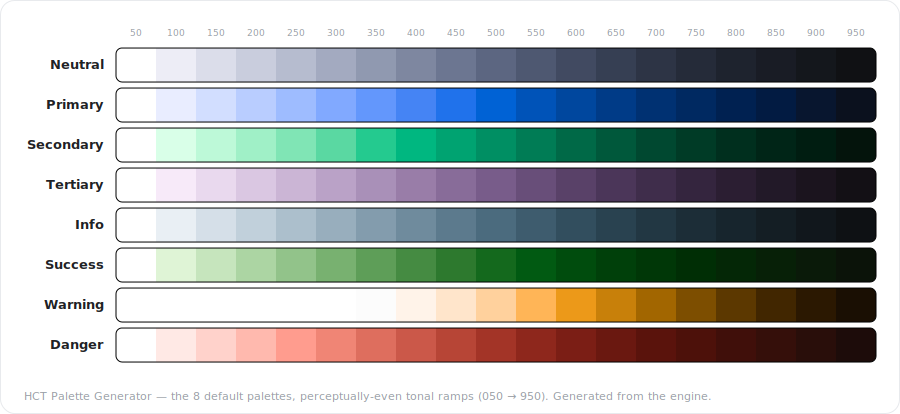

# HCT Palette Generator

[](https://github.com/kimgranlund/hct-palette-generator/actions/workflows/ci.yml)
[](https://kimgranlund.github.io/hct-palette-generator/)

**▶ [Try it live](https://kimgranlund.github.io/hct-palette-generator/)** — the dependency-free,
single-file build, served straight from GitHub Pages. (It's the very same `.html` you get from a
local build; download it and it runs offline from `file://`.)

A perceptually-even color-palette tool. It generates tonal ramps in the **HCT** color space
(Hue · Chroma · Tone) so every step is visually even, derives a **37-role semantic layer**
(surfaces, on-colors, outlines, containers, scrims, inverse), and exports to CSS, OKLCH, JSON,
DTCG, Figma variables, and Material UI3 — plus a one-click `.zip` of all of them.

It ships three ways: a **Vite web app**, a single **`<hct-app>` web component**, and a **Figma
plugin** that writes the palette straight into the file's variable collections.

<!-- Hero: regenerate with `npm run gen:preview` (rendered straight from the engine via projectView). -->


> The image above is the tool's **real output** — the eight default palettes rendered straight from
> the engine (no mockup). Note the perceptually-even steps, the in-gamut deep ends, and `Warning`'s
> deliberately lifted light end. Regenerate any time with `npm run gen:preview`.

## Quick start

```bash
npm install
npm run dev        # Vite dev server with HMR (http://localhost:5173)
```

## Build

```bash
npm run build      # gen figma assets → tsc → vite build (dist/) → offline single-file → figma ui.html
npm run preview    # serve the built dist/
```

`npm run build` produces:
- `dist/` — the Vite-built web app.
- `dist/hct-palette-generator.html` — a dependency-free **offline single-file** build (open it
  directly). This is the artifact published to the [live demo](https://kimgranlund.github.io/hct-palette-generator/).
- `figma/plugin/ui.html` — the Figma plugin UI (the bundled app + a postMessage bridge).

## Test

```bash
npm test           # regenerates the build artifacts, then runs every verifier + the headless DOM boot
```

The test suite is the real coverage — pure-`node` verifiers per layer (engine round-trips, tonal-curve
fidelity, the 37-role table vs. the canonical answer key, the five export formats, the Figma raw→semantic
cascade, persistence round-trip, the config I/O + editable-mapping additions) plus a DOM-shim boot
(`test/ui/headless-boot.mjs`) that drives the real `app.js` without a browser.

## Layout

```
src/
  engine/   hct.js · tonal.js · semantic.js · exports.js   — pure ES modules, no DOM
  ui/       model.mjs · app.js · styles.css · persist.js · zip.mjs · figma-plugin-assets.js
  main.ts   — Vite entry (imports the stylesheet + <hct-app>, mounts it)
figma/
  plugin/   code.js · manifest.json · ui.html              — the generator AS a Figma plugin
  binder/   bind-plan.mjs · figma-semantic-binder/          — the standalone Semantic Binder plugin
scripts/    bundle.mjs · gen-figma-ui.mjs · gen-figma-assets.mjs   — build tooling
docs/spec/  the product specification + the canonical data/role-table.json (the answer key)
test/       engine/ · ui/ · figma/ · run.mjs
```

The engine is pure and DOM-free; `src/ui/app.js` defines the `<hct-app>` web component over it; the
Figma plugin reuses the exact same bundle. `docs/spec/data/role-table.json` is the **canonical contract**
the semantic / export / figma verifiers validate against — it is the spec, not a derived file.

## Figma plugin

Two plugins live under `figma/`:

- **`figma/plugin/`** — the generator itself, running inside Figma. In Figma: *Plugins → Development →
  Import plugin from manifest…* and pick `figma/plugin/manifest.json`. Its **Add Variables → Figma**
  action writes a `raw-colors` collection + a `Semantic` collection (Light/Dark) and embeds the
  parametric config in the file (`root pluginData`) for a lossless round-trip.
- **`figma/binder/`** — the standalone **Semantic Binder** (`figma/binder/figma-semantic-binder/`),
  which aliases each semantic role to its raw variable so editing a raw color cascades live.

## License

MIT — see [LICENSE](LICENSE).
